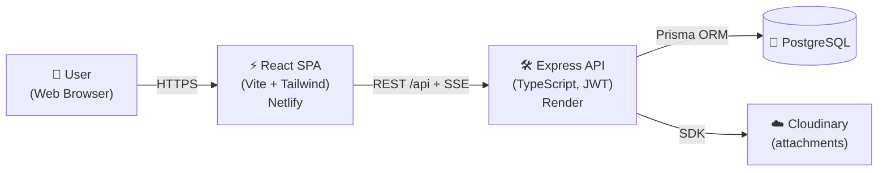
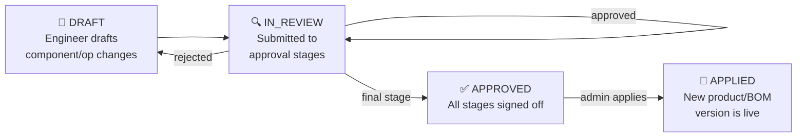

# 🏛️ System Architecture

# **ECOFlow — Engineering Change Order Version Master Data System**

This document describes the overall system architecture, technology stack, folder structure, data flow, and key design decisions for the **ECOFlow** application.

---

## 1. High-Level Architecture

ECOFlow follows a client–server architecture with a React SPA frontend and a stateless Express API backed by PostgreSQL.



- The **frontend** is a single-page app served by Netlify; all API calls go to `/api`, which Netlify proxies to the Render backend (no CORS in production).
- The **backend** is a stateless Express server — horizontal-scale ready; sessions live in JWTs.
- **Real-time** updates use Server-Sent Events (`GET /api/notifications/stream`) with the token passed as a query parameter.

---

## 2. Technology Stack

Technologies used in the project and their purpose:

| Layer | Technology | Purpose |
|---|---|---|
| Frontend | React 19 + Vite | UI framework & build tool |
| Language | TypeScript (both sides) | Type-safe, better developer experience |
| Styling | Tailwind CSS | Dark, modern, utility-first UI |
| Routing | React Router v7 | Client-side routing (SPA) |
| HTTP | Axios | API client with auth interceptors |
| Backend | Node.js + Express | REST API server |
| ORM | Prisma | Type-safe database access & migrations |
| Database | PostgreSQL | Relational master data & ECO history |
| Auth | JWT (access + refresh) | Stateless authentication |
| Files | Cloudinary | Image/attachment storage & CDN |
| Logging | Morgan | HTTP request logging |
| Docs | Postman collection | API testing (`server/postman`, `client/postman`) |
| Deployment (API) | Render | Node web service + PostgreSQL |
| Deployment (Web) | Netlify | Static hosting + `/api` proxy |

---

## 3. Folder Structure

The project follows a client/server split to keep code organized and scalable:

```
ecoflow/
├── client/                        # Frontend (React + Vite + Tailwind)
│   ├── public/                    # Static assets
│   ├── src/
│   │   ├── api/                   # API clients (axios) + DTO types
│   │   ├── components/            # Shared UI (layout, forms, ui/)
│   │   ├── context/               # React context (Auth, Notifications)
│   │   ├── pages/                 # Route pages (Products, ECOs, BOMs…)
│   │   ├── index.css              # Tailwind layers + glass utilities
│   │   └── main.tsx               # App entry
│   ├── postman/postman.json       # Postman collection (frontend copy)
│   ├── netlify.toml → ../netlify.toml  # Netlify config (repo root)
│   └── vite.config.ts             # Dev proxy /api → localhost:5000
│
├── server/                        # Backend (Express + Prisma)
│   ├── prisma/
│   │   ├── schema.prisma          # Data model (User, Product, BOM, ECO…)
│   │   └── seed.ts                # Dev seed data
│   ├── src/
│   │   ├── config/                # db + cloudinary config
│   │   ├── controllers/           # Request handlers per domain
│   │   ├── middleware/            # auth (JWT), authorize (RBAC), errors
│   │   ├── routes/                # 13 route modules mounted under /api
│   │   ├── utils/                 # jwt, password, cloudinary helpers
│   │   └── server.ts              # App bootstrap & route mounting
│   ├── postman/postman.json       # Postman collection (server copy)
│   └── tsconfig.json
│
├── docs/                          # Project documentation (this folder)
├── netlify.toml                   # Frontend build + /api proxy rewrites
└── render.yaml                    # Backend Blueprint (build/start/env)
```

---

## 4. Data Flow (ECO Lifecycle)



1. An **ENGINEERING** user creates an ECO against a product/BOM and stages **draft components/operations** (ADD / UPDATE / DELETE with `originalComponentId`/`originalOperationId` refs).
2. `POST /ecos/:id/submit` moves it to **IN_REVIEW** and notifies approvers.
3. **APPROVER/ADMIN** users call `POST /ecos/:id/review` per approval stage (`fullApproval` to sign all stages at once).
4. An **ADMIN** calls `POST /ecos/:id/apply`, which writes the draft changes into a new product/BOM version and marks the ECO **APPLIED**.
5. Every state change emits an **SSE notification** and an **audit log** entry.

---

## 5. Key Design Decisions

| Decision | Rationale |
|---|---|
| SPA + API (no SSR) | Master-data tool; no SEO needs; simple static hosting on Netlify |
| Same-origin `/api` proxy in prod | Zero CORS config; Netlify rewrite forwards to Render |
| JWT access + refresh tokens | Stateless scaling; short access token (15m) + revocable refresh |
| Role arrays per user (not single role) | Users can be ENGINEERING **and** APPROVER; RBAC via `authorize()` middleware |
| Draft-then-apply ECO model | Live data is never mutated mid-review; apply is atomic and versioned |
| Prisma + PostgreSQL | Relational integrity for versions/components/operations history |
| `prisma generate` inside `npm run build` | Guarantees client generation on every deploy (Render) |
| Postman collection committed | QA + onboarding: full API testable without the UI |
